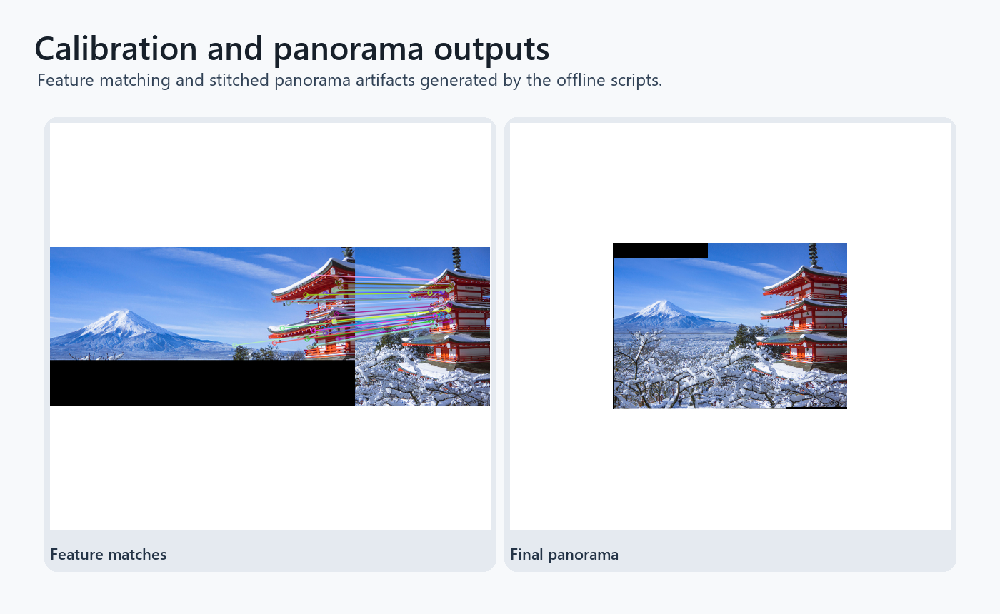

# Camera Calibration and Panorama Stitching

Camera geometry project covering checkerboard calibration, manual perspective alignment, feature matching, RANSAC homography estimation, and panorama stitching.

## Highlights

- Calibrates a camera from checkerboard images and reports reprojection error.
- Computes perspective transforms from point correspondences.
- Matches local image features and estimates homographies with RANSAC.
- Produces match visualizations and a stitched panorama.

## Repository Layout

- `camera_calibration.py` - checkerboard calibration workflow.
- `manual_perspective_stitching.py` - manual correspondences and perspective warping.
- `feature_panorama_stitching.py` - feature matching, RANSAC, and stitching.
- `camera_calibration/` - checkerboard image set.
- `data/` - panorama and alignment source images.
- `examples/` - match visualizations and final panorama.

## Setup

```bash
pip install -r requirements.txt
```

## Run

```bash
python camera_calibration.py
python manual_perspective_stitching.py
python feature_panorama_stitching.py
```

## Stitching output



Feature matching and final stitched panorama from the bundled example images.


## Geometry workflow

- Camera calibration from checkerboard views with an explicit reprojection-error workflow.
- Manual homography stitching and feature-based panorama construction.
- A small, inspectable OpenCV pipeline that exposes intermediate matching artifacts.


## Calibration follow-up

- The examples use a compact offline image set rather than live camera capture.
- The panorama pipeline is tuned for the included views and does not include automatic exposure compensation.
- Next steps: add quantitative calibration reports and a larger image-set smoke test.

